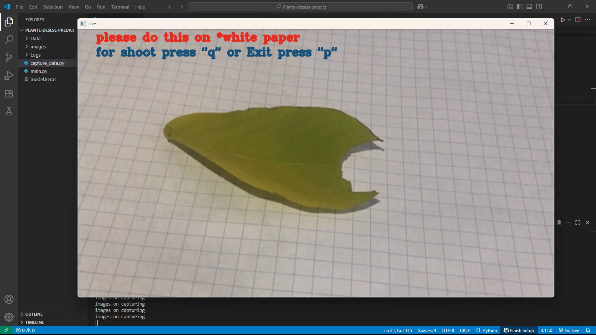
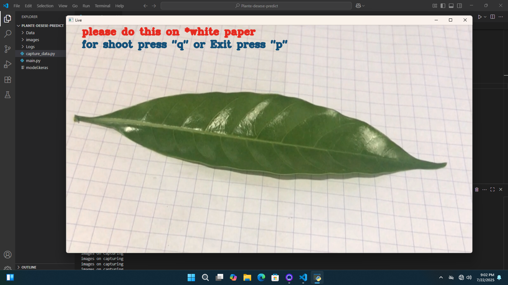
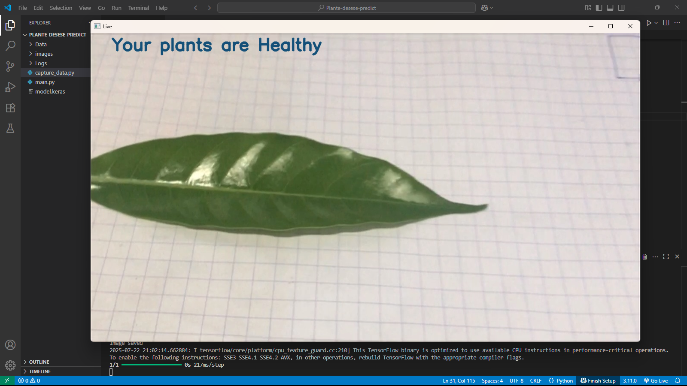

# 🌿 Plant Health Live Detector using CNN

A real-time plant health detection system built using **TensorFlow**, **Keras**, **OpenCV**, and **CNN** to classify plant leaves as **healthy** or **unhealthy** through a live webcam stream.

---

## 🎥 Demo

### 📸 Capturing with Instruction Overlay


### 📷 Capturing a Healthy Leaf


### ✅ Prediction Result


---

## 🧠 How It Works

- The app uses your webcam to continuously scan a leaf placed on a **white paper**.
- A CNN model classifies the leaf image as **Healthy** or **Unhealthy**.
- The result is displayed live on screen.

---

## 📦 Requirements

Install the necessary libraries using:

```bash
pip install -r requirements.txt
